# DevOps Task-02 Nginx Task

This task demonstrates configuring Nginx server . I configured two virtual hosts using two ports (85 and 89) served static HTML pages and implemented basic caching, tested using advanced Linux tools, and verified everything using both terminal and browser.

The project structure includes:
- Two static HTML pages: `rabia85.html`, `rabia89.html`
- Two virtual host configs: `ho85.conf`, `ho89.conf`
- Caching configuration

All screenshots are placed inside the `screenshots/` directory.

---

---

###  Placing HTML Files in the Web Directory

I created two HTML files: `rabia85.html` and `rabia89.html` inside `/var/www/html/`.

**Screenshot:**  
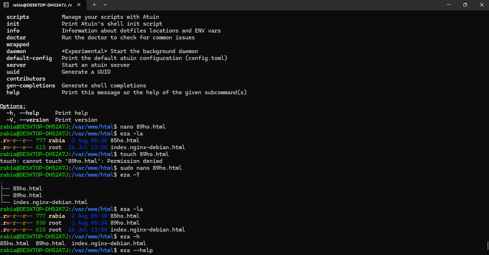

---

###  Creating Virtual Host Config Files

Created two config files: `ho85.conf` and `ho89.conf` inside `/etc/nginx/conf.d/`, each listening on a different port.

**Screenshot:**  
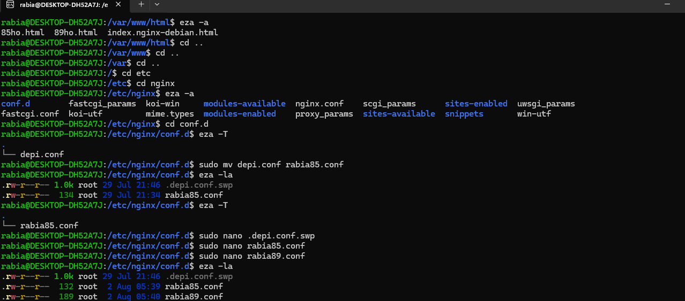

---

###  Writing Configuration and Adding Caching

Configured the server blocks with:
- `listen 85` and `listen 89`
- Proper `root`, `index`, and `location` blocks
- Caching headers using `expires` directive

**Screenshot:**  
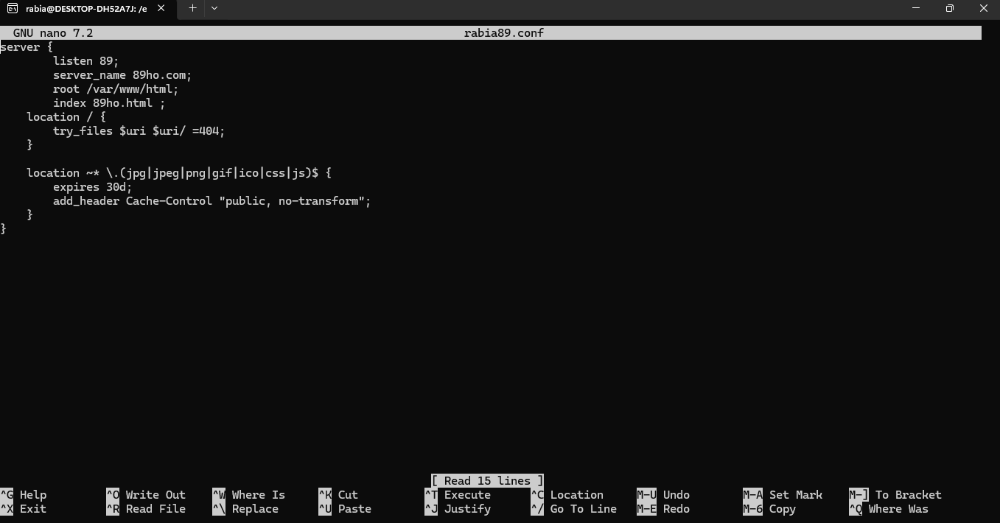

---

###  Restarting, Reloading & Checking Nginx Status

Restarted and reloaded Nginx, and checked its status using traditional commands like `systemctl status`, `nginx -t`, and log checks.

 **Screenshot:**  
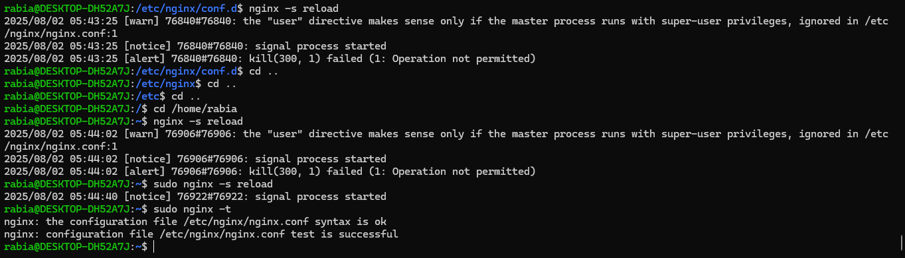

---

###  Using Advanced Tools (btop & procs)

Used modern tools like:
- `btop` to monitor system resources
- `procs` to visualize running processes including Nginx and 

**Screenshot:**  
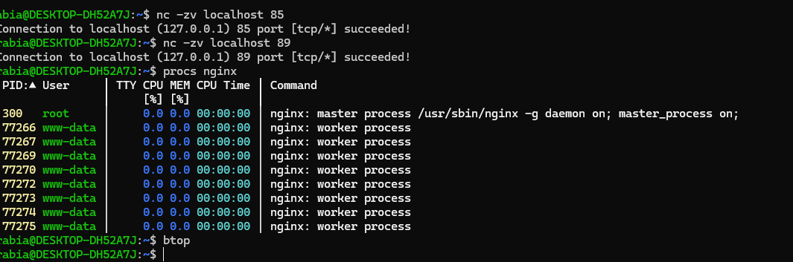

---

###  Verifying Output via curl

Used `curl` to test both ports and verify HTML content delivery directly in the terminal.

**Screenshot:**  
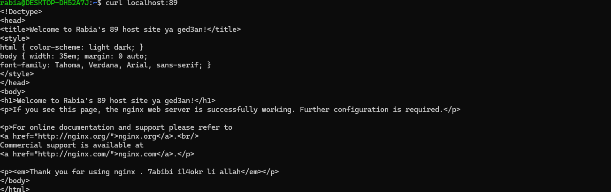

---

### Final Result in Browser

Visited `http://localhost:85` and `http://localhost:89` in a browser to ensure both hosts worked as expected.

**Screenshot – Port 85:**  
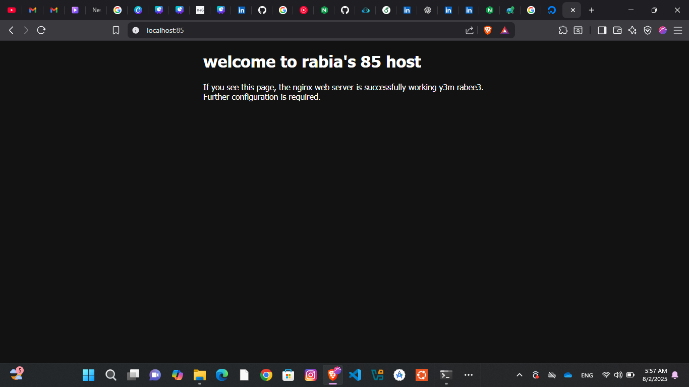

 **Screenshot – Port 89:**  
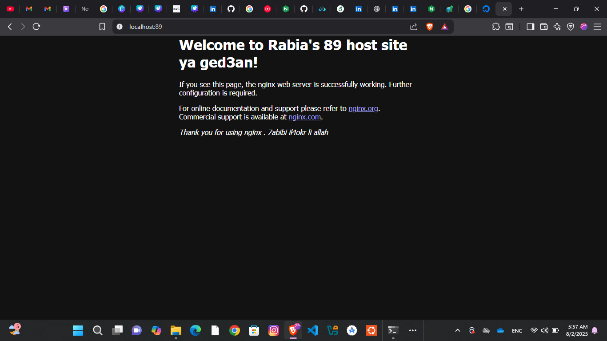

---
###  Creating A Script That Summarizes This Task

**Screenshot:**
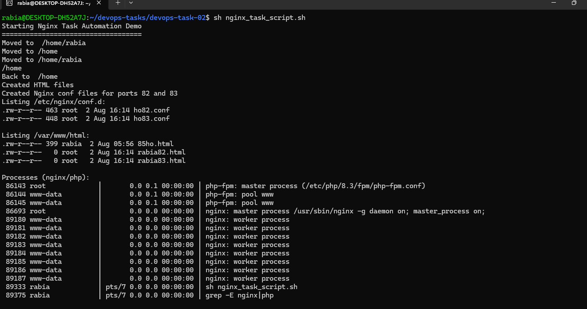

###  thats the final adjustment after i added the php configuration files

**Screenshot:**
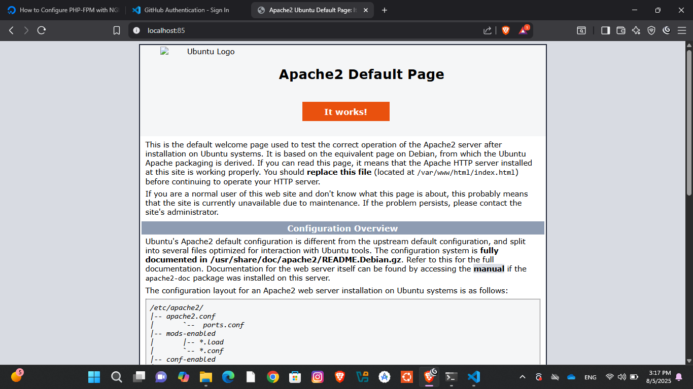
###  thats the conf file of the port 85 after i changed it

**Screenshot:**
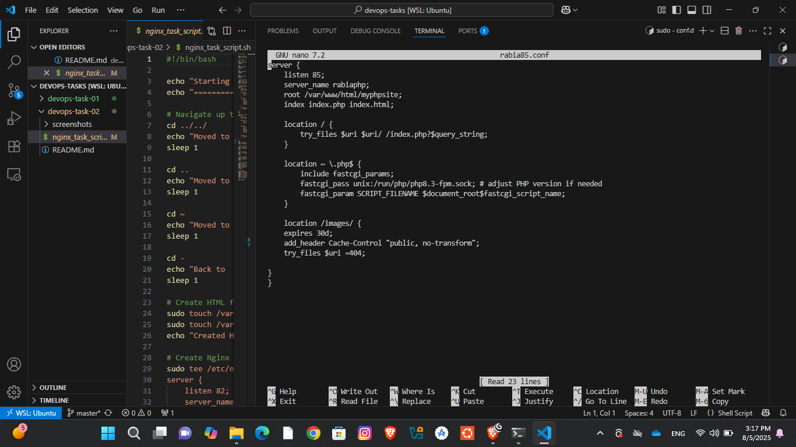

## What I Learned

- How to write clean Nginx server blocks 
- How to configure simple browser caching
- How to use advanced Linux monitoring tools like `procs`, `btop`
- Practical usage of `curl`, Nginx testing commands, and log checking
