# DevOps Task 03 & 04: Docker Image Management, Application Deployment, and Dockerfile Optimization

## Overview

This repository documents my hands-on journey through two essential DevOps tasks—**Task 03: Docker Image Management & Application Deployment** and **Task 04: Dockerfile Optimization & Layer Management**. Each step is illustrated with screenshots (located in the `screenshots/` directory) to provide a visual guide for learners and practitioners.

---

## Task 03: Docker Image Management & Application Deployment

In this task, I explored the practical aspects of working with Docker images and containers, focusing on real-world scenarios and best practices. The steps include:

- **Pulling the Nginx Image:**  
  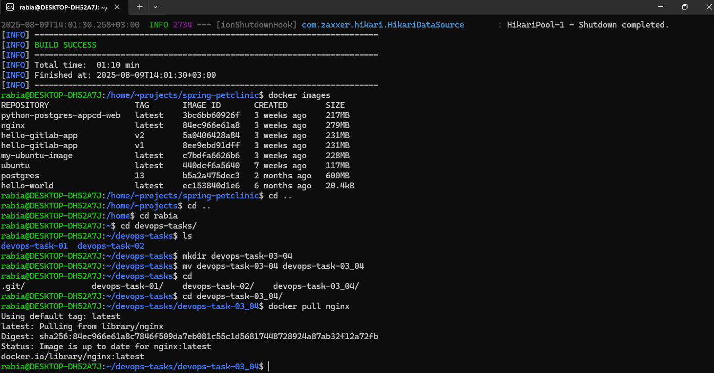

- **Docker Hub Login:**  
  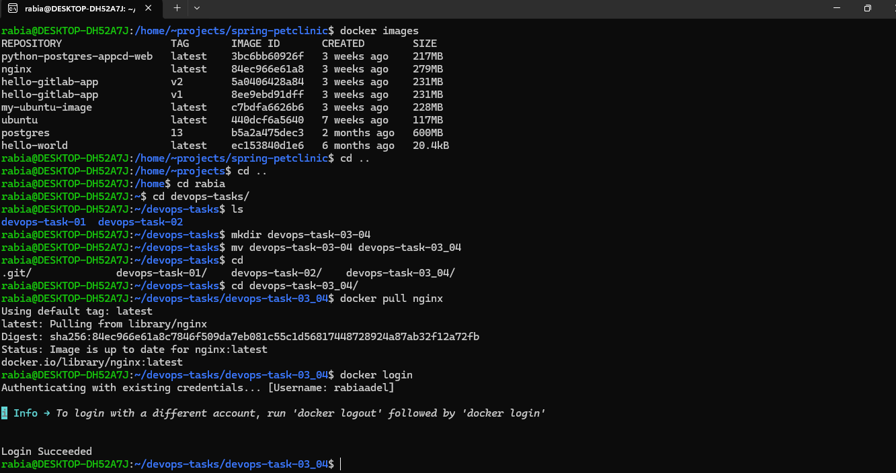

- **Saving and Loading Images:**  
  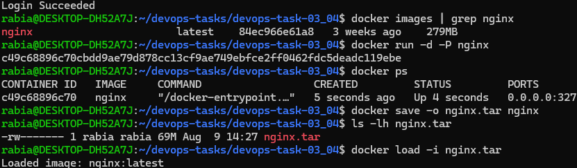

- **Editing Inside an Nginx Container:**  
  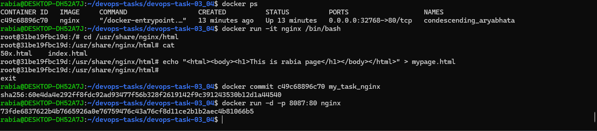

- **Running Nginx on Custom Ports:**  
  

- **Spring PetClinic Application (Terminal):**  
  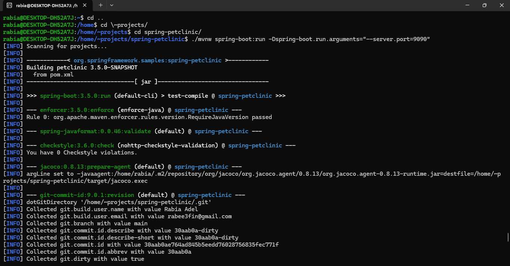

- **Spring PetClinic Application (Browser on 9090):**  
  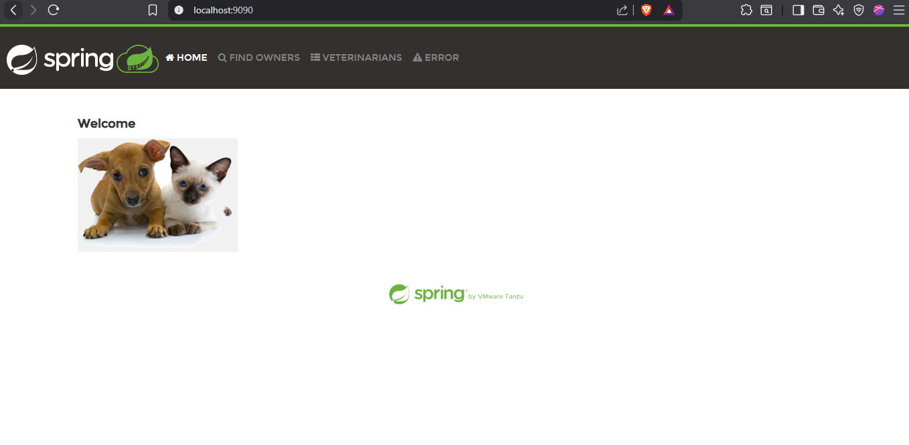

- **Container Management (Stop, Show Image, Tag, Upload):**  
  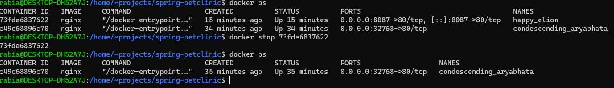
  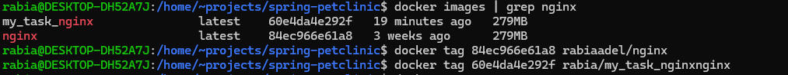

- **Exploring Other Images (Alpine, Node, PHP, Ubuntu):**  
  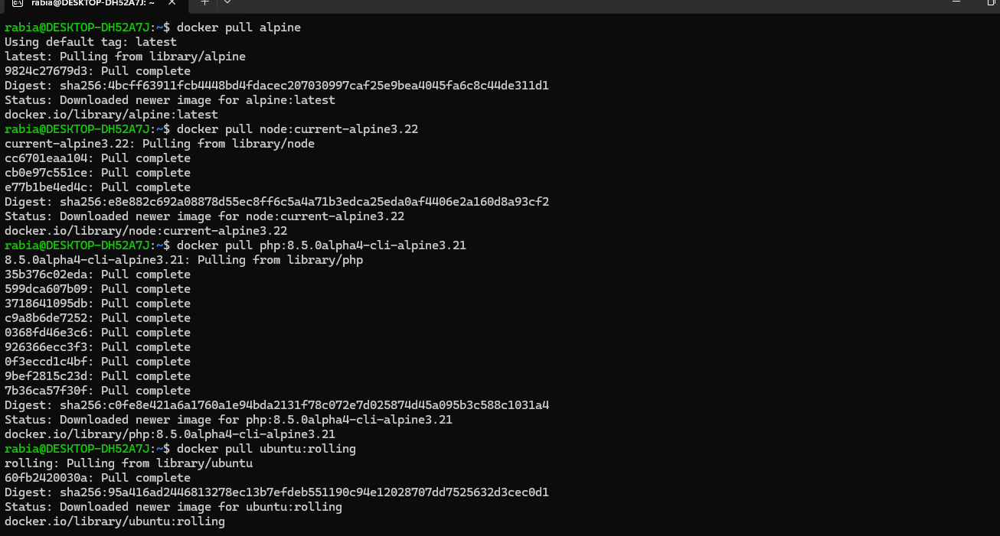

Each step is accompanied by relevant screenshots, making it easy to follow and replicate.

---

## Task 04: Dockerfile Optimization & Layer Management

This task delves into building efficient Docker images using Dockerfiles and understanding how layers impact image size and build performance. The workflow includes:

- **Dockerfile Layers and .dockerignore:**  
  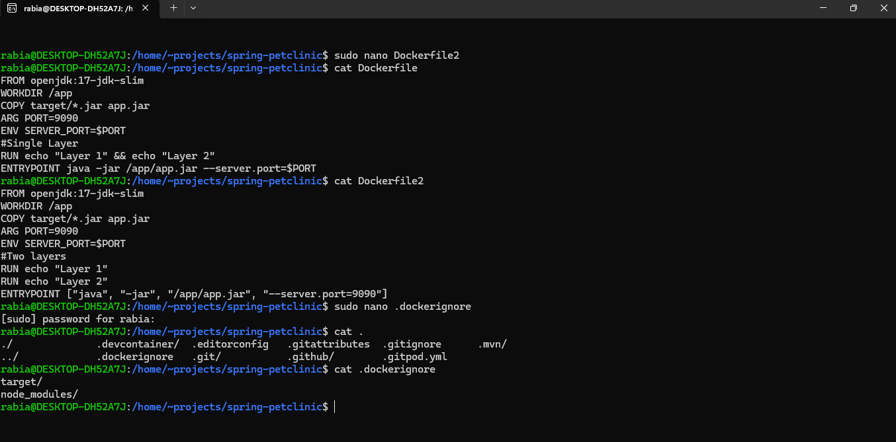

- **Building with Dockerfile:**  
  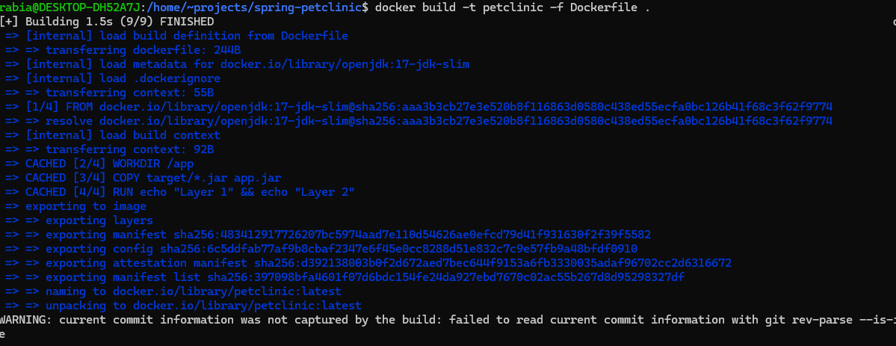

- **Running the Container:**  
  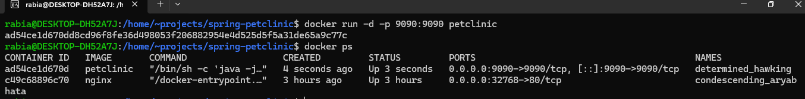

Screenshots for each step are provided to reinforce the concepts and offer a visual reference.

---

