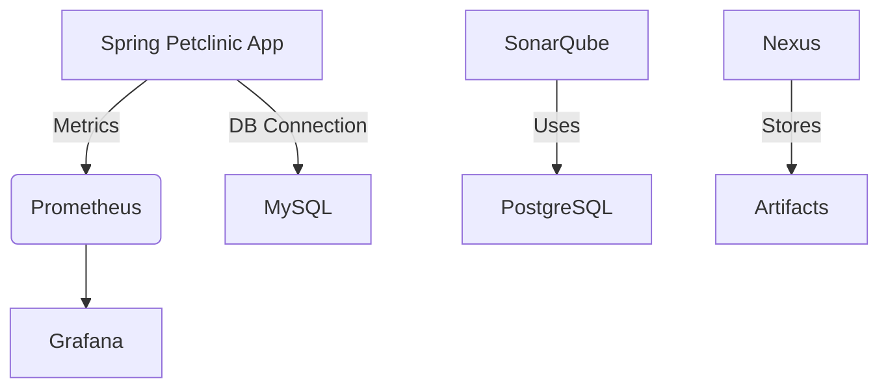

# 🩺 Spring Petclinic Analytics Stack

A production-grade, containerized DevOps environment built around the **Spring Petclinic** application. This stack integrates monitoring, code quality, artifact management, and database services using Docker Compose. It supports multiple environments (dev, prod) and is designed for observability, scalability, and onboarding clarity.

---

## 🧱 Architecture Overview



---

## 📂 File Structure

```
.
├── docker-compose.analytics.yml
├── docker-compose.dev.analytics.yml
├── docker-compose.prod.analytics.yml
├── .env.base
├── .env.dev
├── .env.prod
├── prometheus/
│   └── prometheus.yml
├── grafana/
│   └── provisioning/
│       ├── datasources/
│       │   └── prometheus.yml
│       └── dashboards/
│           └── petclinic-dashboard.json
├── Dockerfile.bepr
└── README.md
```

---

## 🐳 Docker Compose Files

### 🔹 `docker-compose.analytics.yml`

This is the **base orchestration file**. It defines all core services:

- `spring-petclinic-analytics-app`: Spring Boot app exposing Prometheus metrics
- `db`: MySQL database for Petclinic
- `prometheus`: Scrapes metrics from the app
- `grafana`: Visualizes metrics
- `nexus`: Artifact repository
- `sonarqube`: Static code analysis
- `sonar-db`: PostgreSQL backend for SonarQube

It includes:
- Healthchecks for readiness
- Resource limits for realistic simulation
- Environment variables injected from `.env` files

🔧 **Hint**: This file is environment-agnostic. Use it with either `dev` or `prod` overrides.

---

### 🔹 `docker-compose.dev.analytics.yml`

Overrides for **development**:

- Simplified passwords (`dev123`, `devsonar`)
- `ENV=development` triggers dev profile in Spring Boot
- Exposes ports for easy local access
- Relaxed resource limits

🔧 **Usage**:
```bash
docker compose -f docker-compose.analytics.yml -f docker-compose.dev.analytics.yml --env-file .env.base --env-file .env.dev --build up -d
```

---

### 🔹 `docker-compose.prod.analytics.yml`

Overrides for **production**:

- Strong passwords (`superSecurePasswordHere`, `superStrongSonarPass`)
- `ENV=production` triggers prod profile in Spring Boot
- Hardened resource limits
- Secure environment variables

🔧 **Usage**:
```bash
docker compose -f docker-compose.analytics.yml -f docker-compose.prod.analytics.yml --env-file .env.base --env-file .env.prod --build up -d
```

---

## 🔐 Environment Variable Files

### 📄 `.env.base`

Shared across all environments:

```dotenv
DATABASE_HOST=db
DATABASE_NAME=petclinic
MYSQL_DATABASE=petclinic
```

🔧 **Hint**: Keep this minimal and reusable.

---

### 📄 `.env.dev`

Development-specific overrides:

```dotenv
DATABASE_USER=petclinicuser
DATABASE_PASSWORD=petclinicpass
MYSQL_USER=petclinicuser
MYSQL_PASSWORD=petclinicpass
GF_SECURITY_ADMIN_USER=admin
GF_SECURITY_ADMIN_PASSWORD=dev123
SONAR_JDBC_URL=jdbc:postgresql://sonar-db:5432/sonar
SONAR_JDBC_USERNAME=sonar
SONAR_JDBC_PASSWORD=devsonar
POSTGRES_USER=sonar
POSTGRES_PASSWORD=devsonar
ENV=development
```

🔧 **Hint**: Great for onboarding and local testing.

---

### 📄 `.env.prod`

Production-specific overrides:

```dotenv
DATABASE_USER=petclinicuser
DATABASE_PASSWORD=petclinicpass
MYSQL_USER=petclinicuser
MYSQL_PASSWORD=petclinicpass
GF_SECURITY_ADMIN_USER=admin
GF_SECURITY_ADMIN_PASSWORD=superSecurePasswordHere
SONAR_JDBC_URL=jdbc:postgresql://sonar-db:5432/sonarqube
SONAR_JDBC_USERNAME=sonar
SONAR_JDBC_PASSWORD=superStrongSonarPass
POSTGRES_USER=sonar
POSTGRES_PASSWORD=superStrongSonarPass
ENV=production
```

🔧 **Hint**: Never commit this file to version control. Use secrets management in CI/CD.

---

## 📈 Prometheus Configuration

### `prometheus/prometheus.yml`

```yaml
global:
  scrape_interval: 15s

scrape_configs:
  - job_name: 'prometheus'
    static_configs:
      - targets: ['localhost:9090']

  - job_name: 'spring-petclinic'
    metrics_path: '/actuator/prometheus'
    static_configs:
      - targets: ['spring-petclinic-analytics-app:9000']
```

🔧 **Hint**: Ensure Spring Boot exposes `/actuator/prometheus`.

---

## 📊 Grafana Provisioning

### `grafana/provisioning/datasources/prometheus.yml`

```yaml
apiVersion: 1
datasources:
  - name: Prometheus
    type: prometheus
    url: http://prometheus:9090
    access: proxy
    isDefault: true
    editable: true
```

### `grafana/provisioning/dashboards/petclinic-dashboard.json`

Custom dashboard visualizing:
- JVM memory
- HTTP request metrics
- DB connection pool
- Custom business metrics

🔧 **Hint**: Export dashboards from Grafana UI and drop them here for auto-provisioning.

---

## 🧪 SonarQube Setup

### Run Analysis

```bash
mvn clean verify sonar:sonar \
  -Dsonar.projectKey=spring-petclinic \
  -Dsonar.projectName='Spring Petclinic' \
  -Dsonar.host.url=http://localhost:9000 \
  -Dsonar.token=<your-token>
```

🔧 **Hint**: Use `-DskipTests` if integration tests are flaky and you're only interested in static analysis.

---

## 📁 Nexus Repository

Access at [http://localhost:8081](http://localhost:8081)

- Default credentials: `admin / admin`
- Supports Maven, Docker, npm, etc.

🔧 **Hint**: Use Nexus to host internal artifacts and Docker images for isolated environments.

---

## 🧠 What I Learned

- ✅ Docker Compose orchestration with healthchecks, resource limits, and multi-environment layering
- ✅ Monitoring integration using Spring Boot Actuator + Prometheus + Grafana
- ✅ Static code analysis with SonarQube and Maven
- ✅ Artifact management with Nexus
- ✅ Environment modularity using `.env` files and Compose overrides
- ✅ Onboarding best practices via provisioning and documentation

---

## 🧩 Troubleshooting Tips

| Problem                        | Solution |
|-------------------------------|----------|
| App can't connect to DB       | Check `.env` values and MySQL healthcheck |
| Prometheus not scraping       | Confirm endpoint `/actuator/prometheus` is exposed |
| Grafana dashboards missing    | Check provisioning paths and container logs |
| SonarQube fails to start      | Ensure `sonar-db` is healthy and credentials match |
| Nexus admin password missing  | Set `NEXUS_SECURITY_RANDOMPASSWORD=false` in env |
or delete it and use this command : `docker exec -it nexus cat /nexus-data/admin.password`
---

## 🧼 Cleanup

```bash
docker compose down -v
```

---

## 📚 References

- [Spring Petclinic](https://github.com/spring-projects/spring-petclinic)
- [Prometheus Docs](https://prometheus.io/docs/)
- [Grafana Docs](https://grafana.com/docs/)
- [SonarQube Docs](https://docs.sonarqube.org/)
- [Nexus Repository Manager](https://help.sonatype.com/repomanager3)
